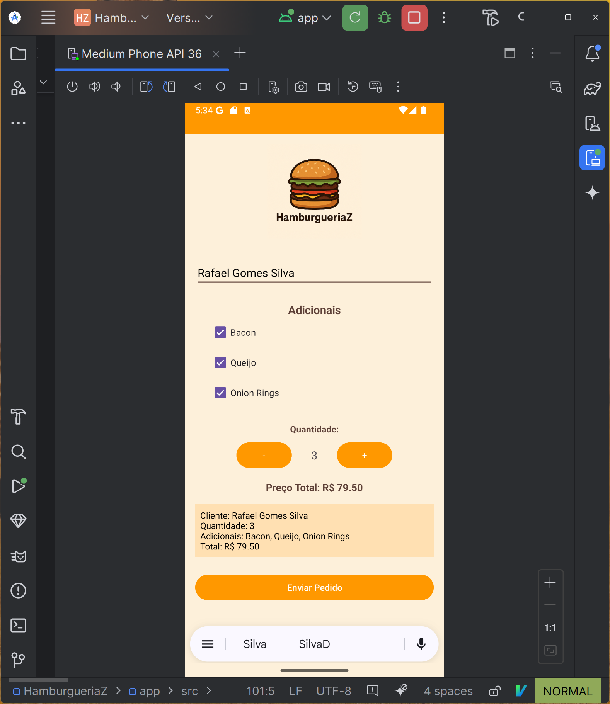
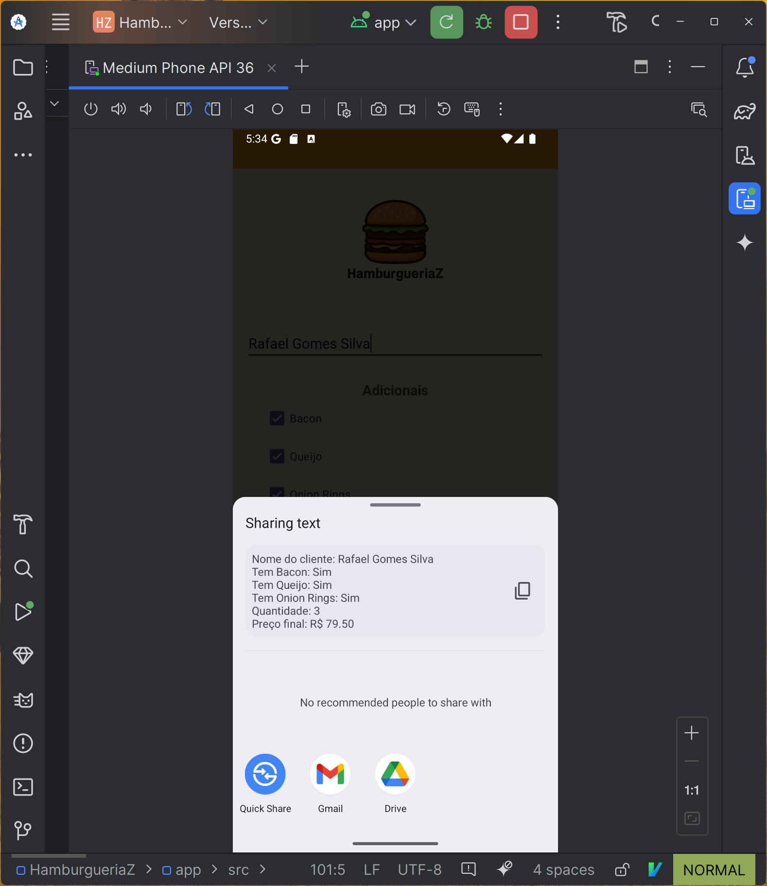
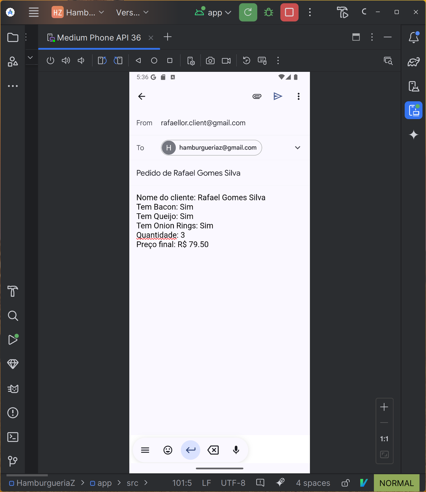

# HamburgueriaZ - Projeto Android

Este repositório contém o código-fonte e a documentação do projeto **HamburgueriaZ**, desenvolvido como parte das atividades práticas da disciplina de **Desenvolvimento Mobile**. O projeto visa aplicar conhecimentos de programação Android utilizando **Java** e o **Android Studio**, explorando elementos como layout XML, intents, estilização visual e integração com aplicativos externos.

---

## 📑 Índice

- [Objetivo do Projeto](#objetivo-do-projeto)
- [Funcionalidades Implementadas](#funcionalidades-implementadas)
- [Principais Desafios](#principais-desafios)
- [Decisões de Projeto](#decisões-de-projeto)
- [Capturas de Tela](#capturas-de-tela)
- [Como Executar](#como-executar)
- [Tecnologias Utilizadas](#tecnologias-utilizadas)
- [Licença](#licença)

---

## 🎯 Objetivo do Projeto

O objetivo deste projeto foi desenvolver um aplicativo mobile funcional, com identidade visual personalizada, capaz de:

- Permitir a seleção de adicionais de um hambúrguer;
- Definir a quantidade desejada;
- Calcular o valor total com base nas opções escolhidas;
- Exibir um resumo do pedido;
- Enviar o pedido por e-mail utilizando um intent personalizado.

---

## ✅ Funcionalidades Implementadas

- Interface amigável e divertida com tema de hamburgueria;
- Campos para nome do cliente e seleção de adicionais;
- Botões para controle de quantidade;
- Atualização dinâmica do preço total;
- Geração automática de resumo do pedido;
- Integração com aplicativo de e-mail para envio do pedido.

---

## ⚠️ Principais Desafios

Durante o desenvolvimento, enfrentamos um problema relacionado ao uso do `Intent.ACTION_SENDTO` com `mailto:` que não funcionava corretamente no **emulador do Android Studio**, mesmo com o Gmail instalado.

### ✔️ Solução:
A substituição por `Intent.ACTION_SEND` com `setType("message/rfc822")` possibilitou a abertura correta do Gmail e outros apps de e-mail no dispositivo, com os campos de assunto e corpo preenchidos automaticamente.

---

## 💡 Decisões de Projeto

- **Java** foi escolhido em vez de Kotlin, por estar alinhado com a proposta do curso.
- Foi adotado o uso de **Kotlin DSL** no `build.gradle.kts` por ser o padrão moderno do Android Studio.
- A interface foi criada manualmente em XML para maior controle visual.
- O tema visual do app seguiu uma paleta quente (#FF9800, #5D4037) com fontes amigáveis para transmitir o clima descontraído de uma hamburgueria.
- A lógica foi separada de forma clara em métodos específicos: controle de quantidade, cálculo de preço, geração do resumo e envio do pedido.

---

## 📸 Capturas de Tela

1. **Pedido preenchido no app**  
   

2. **Lista de apps disponíveis para envio**  
   

3. **Gmail aberto com o pedido pronto para envio**  
   

---

## ▶️ Como Executar

1. Clone este repositório no Android Studio.
2. Conecte um dispositivo físico ou inicie um emulador.
3. Compile e execute o projeto.
4. Preencha o pedido e clique em “Enviar Pedido” para testar a integração com e-mail.

---

## 🛠 Tecnologias Utilizadas

- Android Studio Dolphin ou superior
- Java
- XML para layouts
- Intent API do Android
- Gmail App (para testes de integração)
- Emulador Android API 24+

---

## 📄 Licença

Este projeto foi desenvolvido exclusivamente para fins educacionais e acadêmicos.

---
